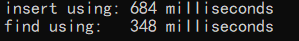

# KV存储引擎

#### 介绍
基于跳表的KV存储引擎（key-value数据对存储），支持多线程访问。

#### 代码

- 采用C++17标准，代码实现是跨平台的，代码编辑采用VS2019。

- 添加同步锁支持多线程插入、查询、删除，底层采用跳表结构，有较好的插入和查找时间复杂度$O(nlog(n))$。
- 定义**CONSOLE** 宏可以将插入、删除、查找等操作信息输出到console上，但会影响引擎性能。
- src文件夹
  - **kvengine.hpp**  KV引擎的源代码
  - **main.cpp** KV引擎的基本用例
  - **performance_test.cpp** KV引擎的插入查询性能测试
- save文件夹
  - **data** KV引擎的磁盘数据

#### 性能测试

- 线程数：3
- 数据量：300000
- 
